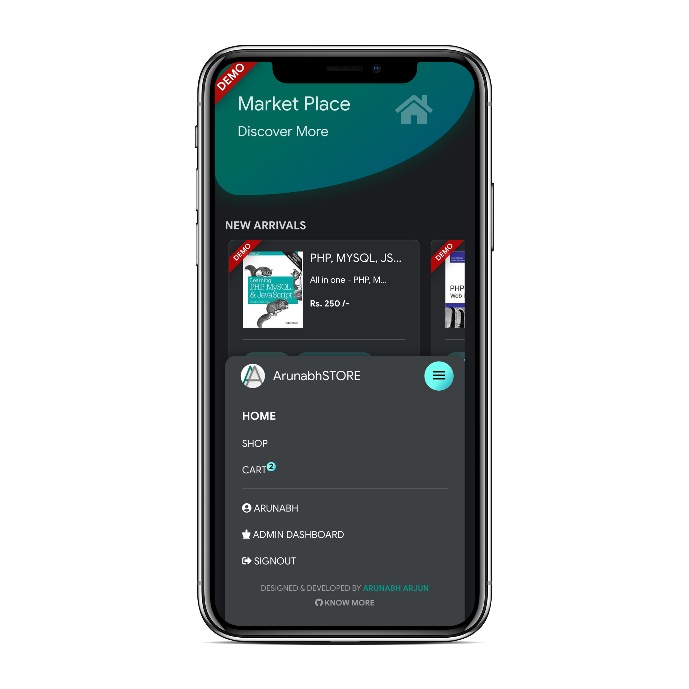

# ECOMMERCE APP USING MERN STACK

### DEMO :

### [`https://arunabhstore.in`](https://arunabhstore.in)  

### DESCRIPTION 

It is an ecommerce web-app built with MERN stack. I developed it just as a hobby. This is a completely functional web-app where one can visit, register, purchase and make transaction with demo products. Needless to say that this web-app is only for demonstration purpose with all functionalities baked in and in working state. If you wish to experience this web-app, I encourage you to go ahead and make a demo purchase with the demo credit card provided in the cheheckout section in cart.  
Hope you'll like it :)

## Screenshots -

  

  

 